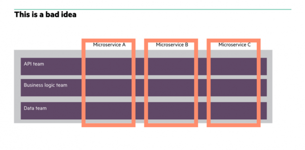
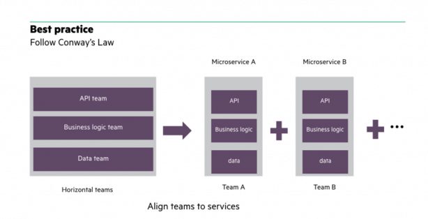
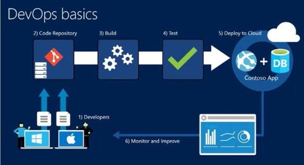

<p style="font-size:80px;">
Effective<br/>Microservices
</p>
[Justin VanWinkle](https://www.jvanwinkle.com)
[@FundamentalDev](https://twitter.com/FundamentalDev)
```notes
This talk is intended to demonstrate that you can't just start implementing microservices without preparation and understanding of what makes them effective.
```

***

Defining "Effective"
<video src="https://media.giphy.com/media/1qG8Tr4G3htja/giphy.mp4"></video>
```notes

```
---
Solve Business Problem
<video src="https://media.giphy.com/media/UKkes2qN2T70s/giphy.mp4"></video>
[More Info](https://docs.microsoft.com/en-us/azure/architecture/microservices/domain-analysis)
```notes
It must own business problem front to back.

If it doesn't, it's a utility, incomplete service, or improperly formed microservice.

Not likely good for use in a production system.
```
---
Minimize Outages
<video loop src="https://media.giphy.com/media/u89uPwAyJSyYg/giphy.mp4"></video>
```notes
Because outages aren't considered effective.
```
---
Fast Response Times
<video src="https://media.giphy.com/media/l4FGwBxQ8VjtzNcv6/giphy.mp4"></video>
```notes
It doesn't serve the end user well if they have to wait 30+ seconds for a response.

This is easier to get wrong than you might think.
```
---
Cost Effective
<video src="https://media.giphy.com/media/3ohjV1wV5q38uFVjG0/giphy.mp4"></video>
```notes
Microservices shouldn't make finance cringe when they write the checks.

If your microservices are formed properly, your cost should be naturally effective.
```
---
Deploy Easily and Regularly

```notes
A fully automated DevOps pipeline is necessary.

If you can't deploy regularly, you have a constraint.

Otherwise, efficiency is lost in manual tasks.
```

***
***

Defining "Microservice"
```notes
Let's make sure we understand what a microservice is -- and isn't.
```
---
Monolith

```notes
Like a large object that has been carved into shape.

Intersection/conflict between business requirements.

Competing interest in overlapping areas. 

Marketing changes break finance features or change business rules.
```
---
Nanoservice

```notes
Like free-form legos.

Each lego is generic in design.

This means you are building services for tasks. (Retrieve song information - can be shared by other services that call it)

Services depend on services depend on services.  
* Debugging by tracing is terrible.  
* SLAs are terrible.  
* Cost is terrible. 
```
---
Microservice

```notes
Specific subset of SOA in which services own their entire vertical.

Like a lego kit.  

Each lego is shaped to serve a specific purpose in the bigger picture.

Each "specific purpose" is a business requirement. (Play music and search for music -- these can use the same modules, but should individually and independently be responsible for retrieving title and description; no call to a shared service.)

The "bigger picture" is the business as a whole or an end-facing application.
```

***
***

Gotchas
```notes

```
---
Ineffective Service Boundaries
[More Info](https://docs.microsoft.com/en-us/azure/architecture/microservices/microservice-boundaries)
```notes
Identify verticals -- a self-contained context that represents a particular subdomain of the larger application.
```
---
No Automation
[More Info](https://docs.microsoft.com/en-us/azure/architecture/microservices/ci-cd)
```notes
Automate build, test, and deployment
* Faster release cycles
* Fewer bugs reach production
```
---
No Logging and Monitoring
[More Info](https://docs.microsoft.com/en-us/azure/architecture/microservices/logging-monitoring)
```notes
Dozens or even hundreds of services.
Logging for tracing.
Monitoring for holistic view of health.
```
---
Ineffective Org and Team Structure
>Conway's Law: Organizations which design systems are constrained to produce designs which are copies of the communication structures of these organizations.
```notes
```
---
Ineffective Org and Team Structure

```notes
Major cause of constraint.
Poor communication.
Many hands involved.
```
---
Ineffective Org and Team Structure

```notes
1 team per vertical.
Build-and-run teams.
Dev, ops, test, product management.
100% ownership.
```
---
Lacking DevOps Culture
[More Info](https://docs.microsoft.com/en-us/azure/devops/learn/what-is-devops-culture)
```notes
Note "culture".
Not a DevOps guy.
Not a DevOps department.
A culture shift with shared buy-in.
You build it -- you run it.
```

***
***

## Tools
```notes

```
---
### DevOps
```notes
Complete CI/CD
* Azure DevOps
* GitHub Pipelines
* Jenkins
```
---
### Configuration as Code
```notes
Version control
Change tracking
Audit logging
```
---
### Infrastructure as Code
```notes
Version control
Change tracking
Audit logging
```
---
### The Cloud
```notes
Lots to take advantage of:
* Autoscaling
* Monitoring
* Simplicity of setup and configuration
```
---
### Docker
```notes
All-in-one packaging
Reproducability
```
---
### Kubernetes
```notes
Scaling
Redundancy
Orchestration
```
***
***
Creation Process
```notes

```
---
1 - Identify and Plan Boundaries
[More Info](https://docs.microsoft.com/en-us/azure/architecture/microservices/domain-analysis)
[Even more info](https://docs.microsoft.com/en-us/azure/architecture/microservices/microservice-boundaries)
```notes
This is critical.
Lots of literature.
```
---
2 - Write Minimum Viable Service
```notes
Gotta start somewhere.
Aside from poor boundaries, it's mostly easy to refactor for lessons learned.
```
---
3 - Implement CI/CD

```notes
Codify Infrastructure
Codify Configuration
Build CI/CD Pipeline
```
---
4 - Containerize (Optional)

```notes
There are benefits to be realized.
But only case-by-case.
Learning curve.
```
---
5 - Orchestrate (Optional)

```notes
Massive benefits.
Learning curve.
```

***
***

Key Takeaways
```notes

```
---
### Automate Everything
```notes
Build
Test
Release/Deploy
Infrastructure
Configuration
```
---
### Codify Everything
```notes
Service
Infrastructure
Configuration
Build
Deploy
```
---
### Test Everything
```notes
Load Test early and often
Acceptance test
Unit Test
Integration Test
Shift testing left in schedule
```
---
### Monitor Everything
```notes

```

***
***
## Next Steps
```notes

```
---
### Literature
```notes
DDD
DDD Quickly
MSFT Docs
```
---
### Reach Out
```notes

```
---
### Follow Me
```notes

```
***


